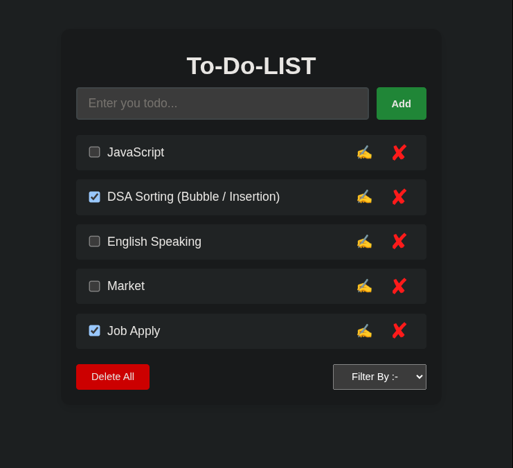

That's awesome that you taught your friends how to build this Todo app in just 2 days without using Google! Here's a **README.md** file you can use for your project. It highlights your learning, teaching, and what the app does:

---

# 📝 Vanilla JS Todo List

This is a simple and clean **Todo List** web application built using only **HTML**, **CSS**, and **JavaScript (no frameworks)**.

## 🚀 Project Highlights

* Add, check, edit, and delete todos
* Fully functional UI
* Built using only vanilla JS DOM methods
* Styled with responsive CSS
* No frameworks or libraries used

## 🎓 Why This Project?

I created this project as a personal challenge and also to **teach my friends everything from scratch** — without using Google or external help. In just **2 days**, I explained:

* How DOM manipulation works in JavaScript
* How to structure code using modules (`export` / `import`)
* Creating and styling UI components with pure CSS
* How to manage application state like `todoData`

## 📂 Folder Structure

```
/todo-app
│
├── index.html       # Main HTML file
├── style.css        # Styling for the app
├── script.js        # Main JavaScript file
├── image.png        # ScreenShot
└── todo.js          # Function to create todo elements
```

## 📸 Screenshots



## ✍ How It Works

1. Type your task into the input box
2. Click "Add" to create a new todo
3. Use ✅ checkbox to mark as completed
4. Click ✍ to edit or ✖ to delete a task

## 🙌 Author

**Vishwajeet Kumar**

I built this to challenge myself and help others learn the core building blocks of web development.

---

Let me know if you'd like to turn this into a GitHub repository with commit history or Git commands explanation too!

